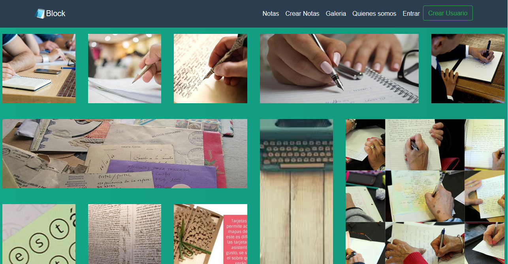

## BLOCK | STACK MERN

Aqui puede ver las capturas de como funcima la pagina 

Lista de notas

Crear notas

Galeria

Quienes somos

Ingresar

Crear usuarios

## Para intalar 

Abrir una terminal ubicado en: 

### `/backend/`

Ingresar los siguientes codigos:

### `npm install`

### `npm rund dev`

En otra terminal ubicado en:

### `/frontend/`

Ingresar los siguientes codigos:

### `npm install`

### `npm start`

### CREADORES

#### Juan Sebastian Esquivel Plazas             COD:20162151297

#### Sebastian Fajardo Garzón                   COD:20162152759

#### stiven garces sanchez                      COD:20162153046

#### Santiago Esteban Lozano Rodríguez          COD:20162152331
